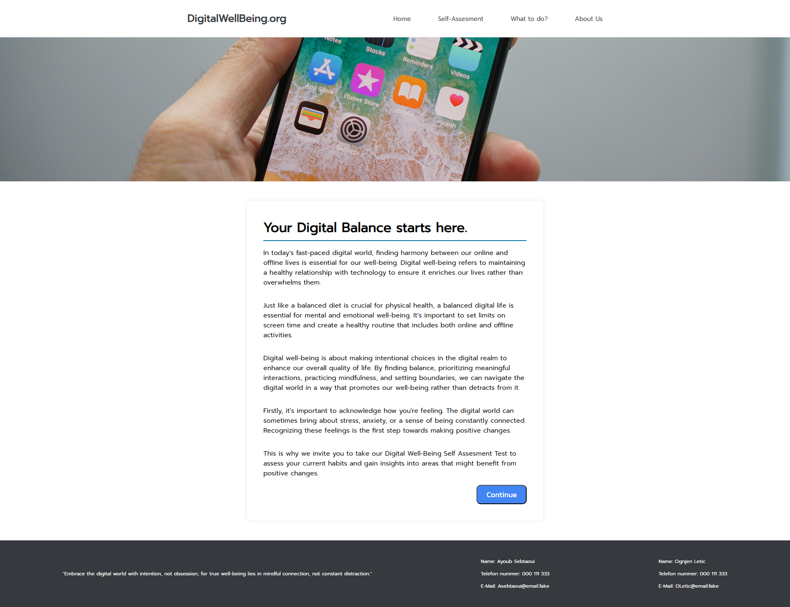
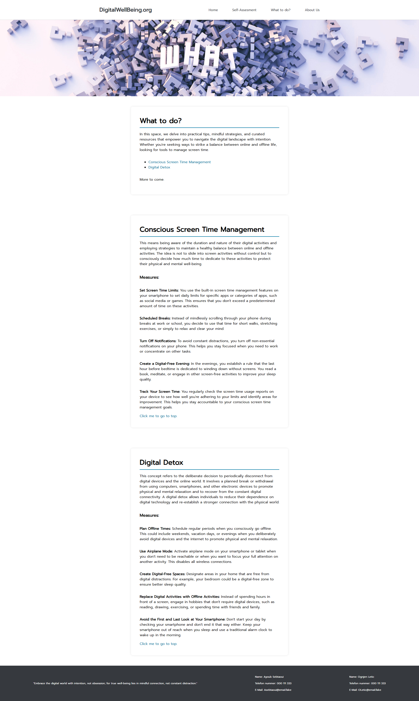
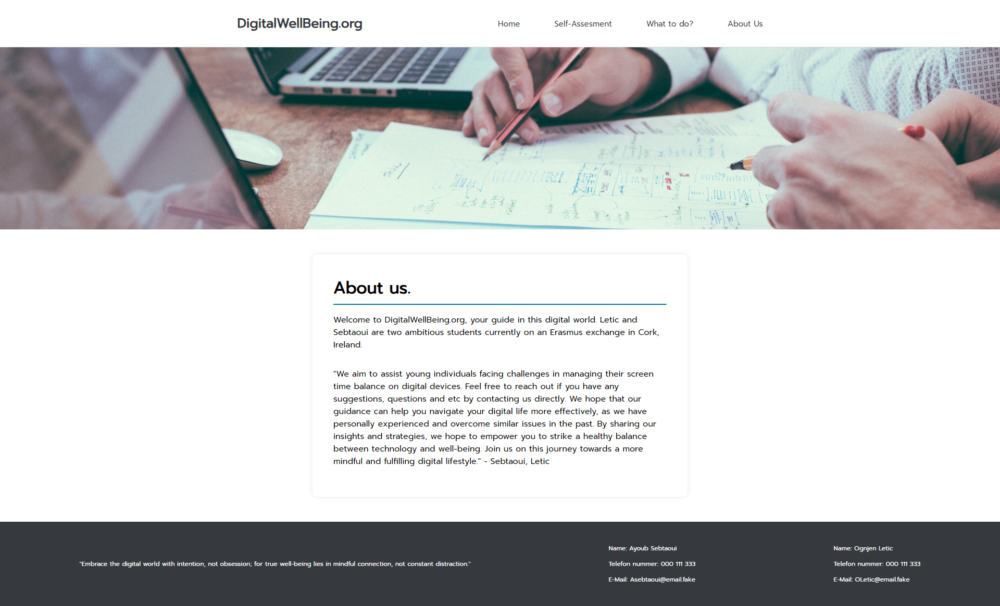
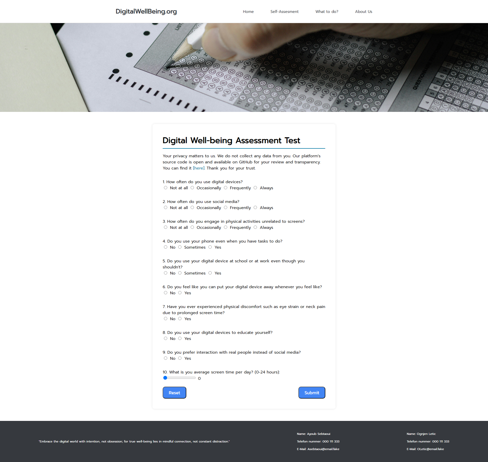

# Digital Well Being Website Project

## Overview

Welcome to the Digital Well Being Website project! This project is a collaborative effort by two students who were given a task to make a website on Digital Well-being. In this README file, you'll find essential information about the project, its goals and features.

## Project Goals

The primary goal of this project is to create a user-friendly website that educates and promotes digital well-being. The website aims to address the following:

1. **Awareness:** Raise awareness about the importance of maintaining a healthy balance between online and offline activities.

2. **Guidance:** Provide practical tips and guidance on how individuals can enhance their digital well-being.

3. **Resources:** Curate resources, articles, and tools related to digital well-being.

## Features

<div align="center">
  
</div>

- **Homepage:** A welcoming introduction to the concept of digital well-being.

<div align="center">
  
</div>

- **Self-Assesment:** A form to help you asses your digital well being.

<div align="center">
  
</div>

- **What to do?:** Practical tips and tricks for maintaining a healthy digital lifestyle.

<div align="center">
  
</div>

- **About us:** A small page that tells you some information about us.

## Technologies Used

- **Frontend:** HTML, CSS, JavaScript
- **Version Control:** Git

## Setup Instructions

1. Clone the repository to your local machine:

   ```bash
   git clone https://github.com/vuk77/digitalwellbeing.org
   ```

2. Navigate to the project directory:

   ```bash
   cd digitalwellbeing.org
   ```

3. Open the `index.html` file in your preferred web browser to view the website locally.

## Contributing

We welcome contributions from the community! If you'd like to contribute to the project, please get in contact with me or Ayoub.

## Feedback

If you have any feedback, suggestions, or issues to report, please use the [Issues](https://github.com/Vuk77/digitalwellbeing.org/issues) section of this repository.

## License

This project is licensed under the [MIT License](LICENSE). Feel free to use, modify, and distribute the code as needed.

---

Thank you for your interest in our Digital Well-being Website project! We hope it serves as a valuable resource for promoting a healthy and mindful approach to the digital world.
